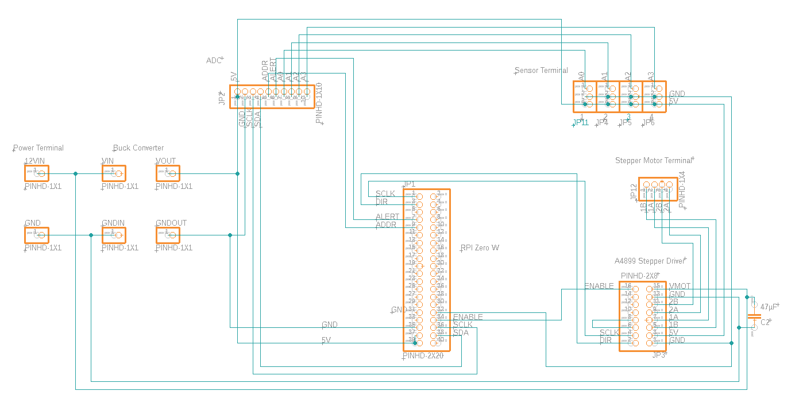

💧 About 💧
===========

This Repository contains the files for a watering system using a stepper motor to power a 3d printed peristaltic pump. A Raspberry Pi Zero W is used to host a small flask webserver with a webapp to control the pump either manually or automatically when a certain humidity level is reached and to display the data. 

✍️ Code Structure
=========
  
  This Project uses the WAM software architecture approach. The following structure should be used:
  
  |  
  |__Fachwerte  
  |  
  |__Materialien  
  |  
  |__Werkzeuge  
  |  
  |__static  
  |  
  |__templates  
  
  Fachwerte  
  - basic values that are not mutable (e.g. date, water_level)  
  
  Materialien  
  - modules that use Fachwerte  
  
  Werkzeuge  
  - use Materialien and Fachwerte and display the results in a GUI  

  static
  - contains css and js files  

  templates
  - contains html files

:heavy_check_mark: prerequisites
=============
- git installed  
-  >= python3.6  
- pip3 installed  
- venv installed  
- sqlite3 installed  
- influxdb installed

:wrench: setup
=====
- create virtualenv  
`python3 -m venv path/to/venv/wsys_env`

- activate virtualenv  
`source path/to/venv/wsys_env/bin/activate`

- install dependencies  
`pip3 install -r requirements.txt`

- enable i2c  
`sudo raspi-config`
- InterfaceOptions -> I2C

- create database  
`sqlite3 wsys_db.db`

- create tables  
navigate to <ip-address>/create

- export FLASK_ENV=development  
- export FLASK_APP=wsgi.py  
- flask run --host 0.0.0.0  
  
  
 🔌 wiring
 ======
  
 
  
  
  ❔
  ===
  
  Feel free to contact me if you have any questions
